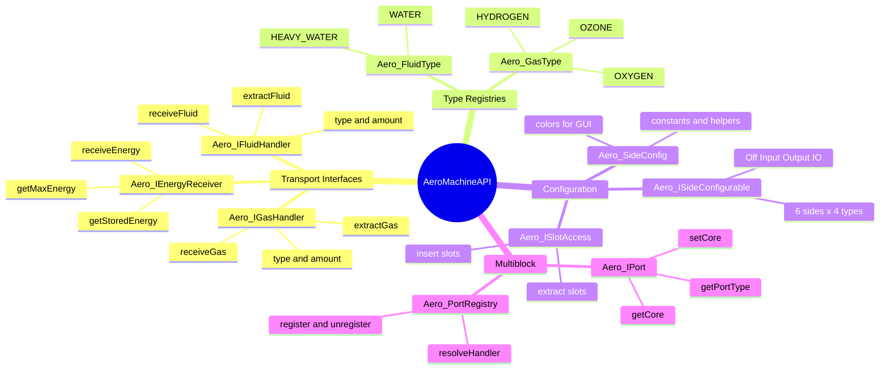
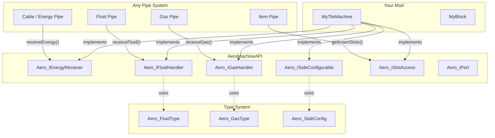
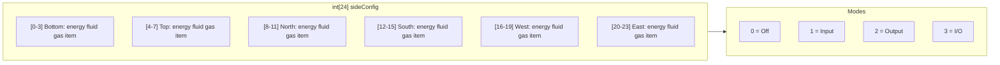
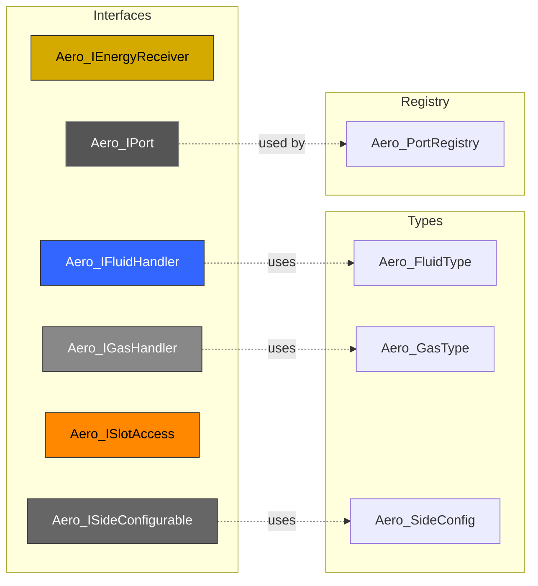
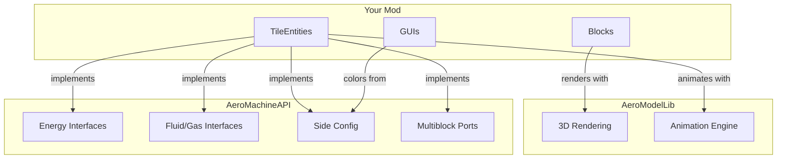

# AeroMachineAPI

> Tech mod infrastructure for Minecraft Beta 1.7.3 (RetroMCP/ModLoader).
> Standardized interfaces for energy, fluids, gases, side configuration, and multiblock ports.
> Author: lucasrgt - aerocoding.dev

**Compatibility:** Java 8 | Minecraft Beta 1.7.3 | RetroMCP | ModLoader/Forge 1.0.6

---

## Table of Contents

1. [Quick Start](#1-quick-start)
2. [Architecture](#2-architecture)
3. [Energy System](#3-energy-system)
4. [Fluid System](#4-fluid-system)
5. [Gas System](#5-gas-system)
6. [Side Configuration](#6-side-configuration)
7. [Item Slot Access](#7-item-slot-access)
8. [Multiblock Ports](#8-multiblock-ports)
9. [API Reference](#9-api-reference)
10. [Patterns & Best Practices](#10-patterns--best-practices)
11. [Integration Example](#11-integration-example)

---

## 1. Quick Start

### Make your machine receive energy

```java
public class MyTileMachine extends TileEntity implements Aero_IEnergyReceiver {
    private int energy = 0;
    private static final int MAX_ENERGY = 1000;

    public int receiveEnergy(int amount) {
        int accepted = Math.min(amount, MAX_ENERGY - energy);
        energy += accepted;
        return accepted;
    }

    public int getStoredEnergy() { return energy; }
    public int getMaxEnergy() { return MAX_ENERGY; }
}
```

### Make your machine handle fluids

```java
public class MyTileTank extends TileEntity implements Aero_IFluidHandler {
    private int fluidType = Aero_FluidType.NONE;
    private int fluidAmount = 0;
    private static final int CAPACITY = 8000; // mB

    public int receiveFluid(int type, int amountMB) {
        if (fluidType != Aero_FluidType.NONE && fluidType != type) return 0;
        int accepted = Math.min(amountMB, CAPACITY - fluidAmount);
        if (accepted > 0) { fluidType = type; fluidAmount += accepted; }
        return accepted;
    }

    public int extractFluid(int type, int amountMB) {
        if (fluidType != type) return 0;
        int extracted = Math.min(amountMB, fluidAmount);
        fluidAmount -= extracted;
        if (fluidAmount == 0) fluidType = Aero_FluidType.NONE;
        return extracted;
    }

    public int getFluidType() { return fluidType; }
    public int getFluidAmount() { return fluidAmount; }
    public int getFluidCapacity() { return CAPACITY; }
}
```

---

## 2. Architecture

### Mindmap



### How it all connects



### Side config data model



---

## 3. Energy System

### Interface: `Aero_IEnergyReceiver`

Implement this on any TileEntity that accepts energy.

```java
public interface Aero_IEnergyReceiver {
    int receiveEnergy(int amount);  // returns amount actually accepted
    int getStoredEnergy();
    int getMaxEnergy();
}
```

**Unit:** RN (RetroNism energy unit). 1 RN = 1 unit.

**Convention:**
- Pipes call `receiveEnergy()` to push energy into machines
- Return value = how much was actually accepted (for backpressure)
- Machines should reject energy when full (`return 0`)

---

## 4. Fluid System

### Interface: `Aero_IFluidHandler`

Implement this on any TileEntity that stores or processes fluids.

```java
public interface Aero_IFluidHandler {
    int receiveFluid(int fluidType, int amountMB);  // returns accepted
    int extractFluid(int fluidType, int amountMB);   // returns extracted
    int getFluidType();
    int getFluidAmount();
    int getFluidCapacity();
}
```

**Unit:** mB (millibuckets). 1 bucket = 1000 mB.

### Type registry: `Aero_FluidType`

| Constant | Value | Color |
|----------|-------|-------|
| `NONE` | 0 | white |
| `WATER` | 1 | `#3344FF` (blue) |
| `HEAVY_WATER` | 2 | `#1A237E` (dark blue) |

```java
String name = Aero_FluidType.getName(Aero_FluidType.WATER);  // "Water"
int color = Aero_FluidType.getColor(Aero_FluidType.WATER);   // 0xFF3344FF
```

**Adding custom fluids:** Add new `public static final int` constants with incrementing IDs and add cases to `getName()` / `getColor()`.

---

## 5. Gas System

### Interface: `Aero_IGasHandler`

Same pattern as fluids, for gases.

```java
public interface Aero_IGasHandler {
    int receiveGas(int gasType, int amountMB);  // returns accepted
    int extractGas(int gasType, int amountMB);   // returns extracted
    int getGasType();
    int getGasAmount();
    int getGasCapacity();
}
```

**Unit:** mB (same as fluids).

### Type registry: `Aero_GasType`

| Constant | Value | Color |
|----------|-------|-------|
| `NONE` | 0 | white |
| `HYDROGEN` | 1 | `#88BBFF` (light blue) |
| `OXYGEN` | 2 | `#FF8888` (light red) |
| `OZONE` | 3 | `#99DDFF` (cyan) |

---

## 6. Side Configuration

### Interface: `Aero_ISideConfigurable`

Implement this to make a machine's sides configurable (what goes in/out of each face).

```java
public interface Aero_ISideConfigurable {
    int[] getSideConfig();                       // int[24] flat array
    void setSideMode(int side, int type, int mode);
    boolean supportsType(int type);              // does this machine handle this type?
    int[] getAllowedModes(int type);             // which modes are valid?
}
```

### Constants: `Aero_SideConfig`

**IO Modes:**

| Constant | Value | Meaning |
|----------|-------|---------|
| `MODE_NONE` | 0 | Disabled |
| `MODE_INPUT` | 1 | Accept from pipes |
| `MODE_OUTPUT` | 2 | Push to pipes |
| `MODE_INPUT_OUTPUT` | 3 | Both directions |

**Transport Types:**

| Constant | Value |
|----------|-------|
| `TYPE_ENERGY` | 0 |
| `TYPE_FLUID` | 1 |
| `TYPE_GAS` | 2 |
| `TYPE_ITEM` | 3 |

**Sides (standard Minecraft):**

| Constant | Value |
|----------|-------|
| `SIDE_BOTTOM` | 0 |
| `SIDE_TOP` | 1 |
| `SIDE_NORTH` | 2 |
| `SIDE_SOUTH` | 3 |
| `SIDE_WEST` | 4 |
| `SIDE_EAST` | 5 |

### Storage format

Flat `int[24]` array: `index = side * 4 + type`

```java
// Get mode for North side, Energy type:
int mode = Aero_SideConfig.get(config, Aero_SideConfig.SIDE_NORTH, Aero_SideConfig.TYPE_ENERGY);

// Set South side, Fluid type to Output:
Aero_SideConfig.set(config, Aero_SideConfig.SIDE_SOUTH, Aero_SideConfig.TYPE_FLUID, Aero_SideConfig.MODE_OUTPUT);
```

### Helper methods

| Method | Returns | Description |
|--------|---------|-------------|
| `get(config, side, type)` | `int` | Read mode from flat array |
| `set(config, side, type, mode)` | `void` | Write mode to flat array |
| `cycleMode(current)` | `int` | Next mode (0 -> 1 -> 2 -> 3 -> 0) |
| `oppositeSide(side)` | `int` | Opposite face (XOR 1) |
| `canInput(mode)` | `boolean` | True if INPUT or I/O |
| `canOutput(mode)` | `boolean` | True if OUTPUT or I/O |
| `getTypeName(type)` | `String` | "Energy", "Fluid", "Gas", "Item" |
| `getModeName(mode)` | `String` | "Off", "Input", "Output", "I/O" |
| `getSideName(side)` | `String` | "Bottom", "Top", "North", etc. |
| `getColor(type, mode)` | `int` | ARGB color for GUI rendering |

### GUI Colors

| Type | Input | Output | I/O |
|------|-------|--------|-----|
| Energy | `#D4AA00` (dark gold) | `#FFDD55` (light gold) | `#EEC833` (gold) |
| Fluid | `#3366FF` (dark blue) | `#88BBFF` (light blue) | `#5590FF` (blue) |
| Gas | `#888888` (dark gray) | `#CCCCCC` (light gray) | `#AAAAAA` (gray) |
| Item | `#FF8800` (dark orange) | `#FFBB55` (light orange) | `#FF9F2A` (orange) |

---

## 7. Item Slot Access

### Interface: `Aero_ISlotAccess`

Implement this to tell pipes which inventory slots accept items and which to extract from.

```java
public interface Aero_ISlotAccess {
    int[] getInsertSlots();   // slots where items can be pushed IN
    int[] getExtractSlots();  // slots where items can be pulled OUT
}
```

**Example:** A crusher with 1 input slot and 1 output slot:

```java
public int[] getInsertSlots() { return new int[]{0}; }     // slot 0 = input
public int[] getExtractSlots() { return new int[]{1}; }    // slot 1 = output
```

---

## 8. Multiblock Ports

### Interface: `Aero_IPort`

Implement this on TileEntities that act as ports of a multiblock structure.

```java
public interface Aero_IPort {
    TileEntity getCore();          // the controller TileEntity
    void setCore(TileEntity core);
    String getPortType();          // "energy", "item", "fluid"
}
```

### Registry: `Aero_PortRegistry`

Static registry that tracks which world positions are multiblock ports and which controller they belong to.

```java
// Register a port at (10, 64, 20) belonging to controller at (12, 64, 22)
Aero_PortRegistry.registerPort(10, 64, 20, 12, 64, 22,
    Aero_PortRegistry.PORT_TYPE_ENERGY, Aero_PortRegistry.PORT_MODE_INPUT);

// Check if a position is a port
boolean isPort = Aero_PortRegistry.isPort(10, 64, 20);

// Resolve handler: returns TileEntity at pos, or controller if pos is a registered port
TileEntity handler = Aero_PortRegistry.resolveHandler(world, 10, 64, 20);

// Cleanup when multiblock is disassembled
Aero_PortRegistry.unregisterAllForController(12, 64, 22);
```

**Port types:**

| Constant | Value |
|----------|-------|
| `PORT_TYPE_ENERGY` | 1 |
| `PORT_TYPE_FLUID` | 2 |
| `PORT_TYPE_GAS` | 3 |

**Port modes:**

| Constant | Value |
|----------|-------|
| `PORT_MODE_INPUT` | 1 |
| `PORT_MODE_OUTPUT` | 2 |

---

## 9. API Reference

### Aero_IEnergyReceiver

| Method | Returns | Description |
|--------|---------|-------------|
| `receiveEnergy(amount)` | `int` | Push energy in, returns accepted |
| `getStoredEnergy()` | `int` | Current stored energy (RN) |
| `getMaxEnergy()` | `int` | Maximum capacity (RN) |

### Aero_IFluidHandler

| Method | Returns | Description |
|--------|---------|-------------|
| `receiveFluid(fluidType, amountMB)` | `int` | Push fluid in, returns accepted (mB) |
| `extractFluid(fluidType, amountMB)` | `int` | Pull fluid out, returns extracted (mB) |
| `getFluidType()` | `int` | Current fluid type constant |
| `getFluidAmount()` | `int` | Current amount (mB) |
| `getFluidCapacity()` | `int` | Max capacity (mB) |

### Aero_IGasHandler

| Method | Returns | Description |
|--------|---------|-------------|
| `receiveGas(gasType, amountMB)` | `int` | Push gas in, returns accepted (mB) |
| `extractGas(gasType, amountMB)` | `int` | Pull gas out, returns extracted (mB) |
| `getGasType()` | `int` | Current gas type constant |
| `getGasAmount()` | `int` | Current amount (mB) |
| `getGasCapacity()` | `int` | Max capacity (mB) |

### Aero_ISideConfigurable

| Method | Returns | Description |
|--------|---------|-------------|
| `getSideConfig()` | `int[24]` | Flat config array (6 sides x 4 types) |
| `setSideMode(side, type, mode)` | `void` | Set mode for a side+type |
| `supportsType(type)` | `boolean` | Whether this machine handles this type |
| `getAllowedModes(type)` | `int[]` | Valid modes for a type |

### Aero_ISlotAccess

| Method | Returns | Description |
|--------|---------|-------------|
| `getInsertSlots()` | `int[]` | Slot indices for item insertion |
| `getExtractSlots()` | `int[]` | Slot indices for item extraction |

### Aero_IPort

| Method | Returns | Description |
|--------|---------|-------------|
| `getCore()` | `TileEntity` | Controller of the multiblock |
| `setCore(core)` | `void` | Sets the controller reference |
| `getPortType()` | `String` | Port type identifier |

### Aero_PortRegistry (static)

| Method | Returns | Description |
|--------|---------|-------------|
| `registerPort(wx,wy,wz, cx,cy,cz, type, mode)` | `void` | Register a port position |
| `registerPort(..., originalBlockId)` | `void` | Register with original block ID |
| `unregisterPort(wx,wy,wz)` | `void` | Remove a port |
| `unregisterAllForController(cx,cy,cz)` | `void` | Remove all ports of a controller |
| `isPort(wx,wy,wz)` | `boolean` | Check if position is a port |
| `isPortOfType(wx,wy,wz, type)` | `boolean` | Check port type |
| `getPort(wx,wy,wz)` | `int[]` | Raw port data |
| `getPortType(wx,wy,wz)` | `int` | Port type at position |
| `getPortMode(wx,wy,wz)` | `int` | Port mode at position |
| `getOriginalBlockId(wx,wy,wz)` | `int` | Original block before port conversion |
| `getControllerPos(wx,wy,wz)` | `int[3]` | Controller position |
| `getControllerAt(world, wx,wy,wz)` | `TileEntity` | Controller TileEntity |
| `resolveHandler(world, wx,wy,wz)` | `TileEntity` | TileEntity or controller via port |

### Aero_FluidType (static)

| Method | Returns | Description |
|--------|---------|-------------|
| `getName(type)` | `String` | Human-readable name |
| `getColor(type)` | `int` | ARGB color for rendering |

### Aero_GasType (static)

| Method | Returns | Description |
|--------|---------|-------------|
| `getName(type)` | `String` | Human-readable name |
| `getColor(type)` | `int` | ARGB color for rendering |

---

## 10. Patterns & Best Practices

### Always return actual amount

```java
// GOOD: returns how much was accepted
public int receiveFluid(int type, int amountMB) {
    int accepted = Math.min(amountMB, capacity - amount);
    amount += accepted;
    return accepted;
}

// BAD: ignores overflow
public int receiveFluid(int type, int amountMB) {
    amount += amountMB;  // can exceed capacity!
    return amountMB;
}
```

### Lock fluid/gas type

```java
// Reject different fluid types when not empty
public int receiveFluid(int type, int amountMB) {
    if (fluidType != Aero_FluidType.NONE && fluidType != type) return 0;
    // ...
}
```

### Side config in NBT

```java
public void writeToNBT(NBTTagCompound nbt) {
    super.writeToNBT(nbt);
    nbt.setIntArray("SideConfig", sideConfig);
}

public void readFromNBT(NBTTagCompound nbt) {
    super.readFromNBT(nbt);
    int[] saved = nbt.getIntArray("SideConfig");
    if (saved != null && saved.length == 24) {
        sideConfig = saved;
    }
}
```

### Check side config before transfer

```java
// In your pipe's transfer logic:
if (Aero_SideConfig.canInput(
    Aero_SideConfig.get(machine.getSideConfig(), side, Aero_SideConfig.TYPE_ENERGY))) {
    int accepted = machine.receiveEnergy(transferAmount);
}
```

### Use resolveHandler for multiblock-aware pipes

```java
// Instead of just getBlockTileEntity(), use resolveHandler
// It automatically redirects port positions to the controller
TileEntity target = Aero_PortRegistry.resolveHandler(world, x, y, z);
if (target instanceof Aero_IEnergyReceiver) {
    ((Aero_IEnergyReceiver) target).receiveEnergy(amount);
}
```

---

## 11. Integration Example

Complete machine: a simple furnace that uses energy and has configurable sides.

```java
package retronism.tile;

import net.minecraft.src.*;
import retronism.api.*;

public class MyTileFurnace extends TileEntity
    implements Aero_IEnergyReceiver, Aero_ISideConfigurable, Aero_ISlotAccess {

    // Energy
    private int energy = 0;
    private static final int MAX_ENERGY = 5000;
    private static final int ENERGY_PER_TICK = 8;

    // Inventory (slot 0 = input, slot 1 = output)
    private ItemStack[] inventory = new ItemStack[2];

    // Side config
    private int[] sideConfig = new int[24]; // all MODE_NONE by default

    // === Aero_IEnergyReceiver ===

    public int receiveEnergy(int amount) {
        int accepted = Math.min(amount, MAX_ENERGY - energy);
        energy += accepted;
        return accepted;
    }

    public int getStoredEnergy() { return energy; }
    public int getMaxEnergy() { return MAX_ENERGY; }

    // === Aero_ISideConfigurable ===

    public int[] getSideConfig() { return sideConfig; }

    public void setSideMode(int side, int type, int mode) {
        Aero_SideConfig.set(sideConfig, side, type, mode);
    }

    public boolean supportsType(int type) {
        return type == Aero_SideConfig.TYPE_ENERGY || type == Aero_SideConfig.TYPE_ITEM;
    }

    public int[] getAllowedModes(int type) {
        return new int[]{
            Aero_SideConfig.MODE_NONE,
            Aero_SideConfig.MODE_INPUT,
            Aero_SideConfig.MODE_OUTPUT,
            Aero_SideConfig.MODE_INPUT_OUTPUT
        };
    }

    // === Aero_ISlotAccess ===

    public int[] getInsertSlots() { return new int[]{0}; }
    public int[] getExtractSlots() { return new int[]{1}; }

    // === Logic ===

    public void updateEntity() {
        if (energy >= ENERGY_PER_TICK && inventory[0] != null) {
            energy -= ENERGY_PER_TICK;
            // ... smelting logic ...
        }
    }

    // === NBT ===

    public void writeToNBT(NBTTagCompound nbt) {
        super.writeToNBT(nbt);
        nbt.setInteger("Energy", energy);
        nbt.setIntArray("SideConfig", sideConfig);
        // ... save inventory ...
    }

    public void readFromNBT(NBTTagCompound nbt) {
        super.readFromNBT(nbt);
        energy = nbt.getInteger("Energy");
        int[] saved = nbt.getIntArray("SideConfig");
        if (saved != null && saved.length == 24) sideConfig = saved;
        // ... load inventory ...
    }
}
```

---

## Appendix: Class Dependency Map



## Appendix: Ecosystem Overview


